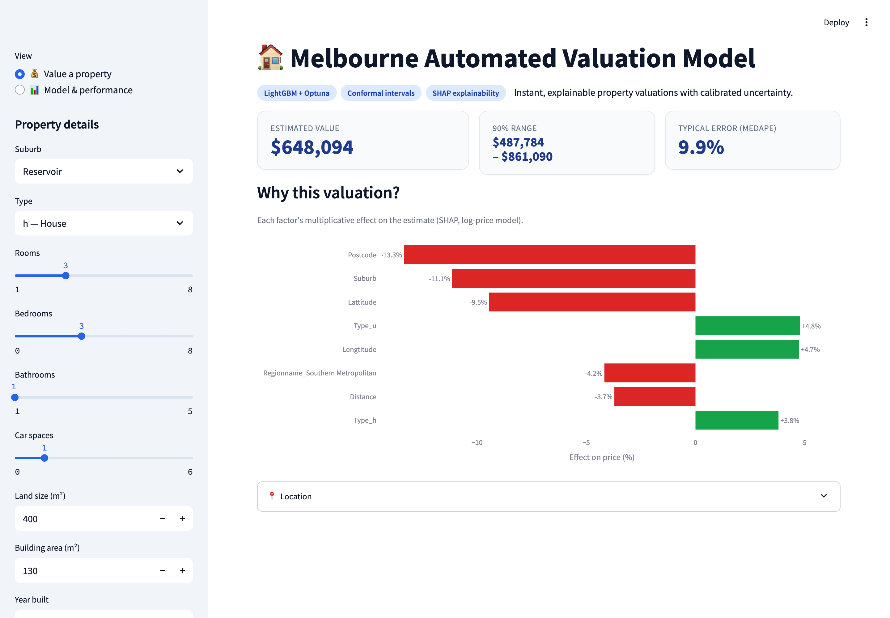
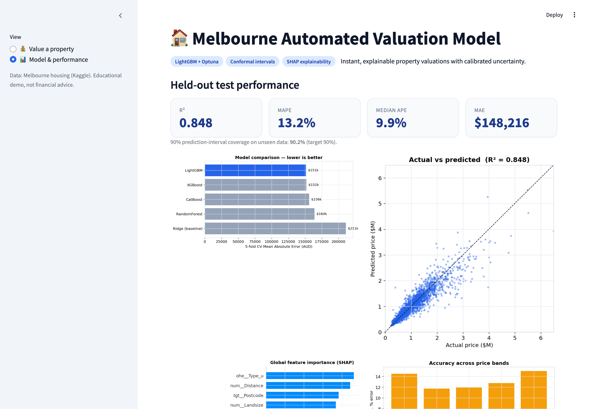

# 🏠 Melbourne Automated Valuation Model (AVM)

An **explainable, uncertainty-aware Automated Valuation Model** for residential property —
the class of instant-pricing systems behind Zillow's *Zestimate*, Redfin, and lender AVMs used
in mortgage origination and portfolio risk. Given a property's attributes it returns a **point
valuation, a calibrated price range, and a per-property explanation** of what drove the number.


> **Live demo:** `streamlit run app.py` &nbsp;·&nbsp; deploy badge added once published to Streamlit Community Cloud.



---

## 1. The problem

Property valuation is high-stakes and hard. Banks, insurers, iBuyers and marketplaces need a
value for *millions* of homes, instantly, without a human appraiser visiting each one. A useful AVM
must therefore be:

1. **Accurate** across a very wide price range (here $85k → $9M).
2. **Honest about uncertainty** — a single number is dangerous for underwriting; decisions need a *range*.
3. **Explainable** — regulators (and customers) require knowing *why* a home was valued as it was.

## 2. Why it's hard (the complexity)

The raw Melbourne dataset (13,580 sales × 21 fields) is exactly the mess real estate data is:

| Challenge | Detail |
|---|---|
| **Heavy missingness** | `BuildingArea` 47% missing, `YearBuilt` 40%, `CouncilArea` 10%. |
| **Skewed target** | Prices span two orders of magnitude and are right-skewed. |
| **High-cardinality location** | 314 suburbs, 200+ postcodes — the strongest price signal, but a leakage trap for naive encoders. |
| **Outliers / data entry errors** | Land sizes of 0 m² and implausible build years. |
| **Serving realism** | The model must predict from *raw* user inputs, not pre-processed arrays. |

## 3. The solution & tech-stack logic

A single scikit-learn pipeline takes a **raw** property row and returns dollars:

```
raw row → ColumnTransformer → LightGBM (log-target) → TransformedTargetRegressor → $ + interval + SHAP
```

| Component | Choice & *why* |
|---|---|
| **Target transform** | Model `log1p(Price)` (via `TransformedTargetRegressor`) so errors are proportional — right for a skewed, multiplicative quantity like price. |
| **Numeric handling** | Median imputation + explicit *missingness flags* (a missing `BuildingArea` is itself a signal — usually a unit). |
| **Low-card categoricals** | One-hot (`Type`, `Method`, `Regionname`) with rare-level grouping. |
| **High-card location** | **Cross-fitted `TargetEncoder`** for `Suburb`/`Postcode`/`CouncilArea` — captures location value *without* leaking the target. |
| **Model** | Gradient boosting (**LightGBM**) — best CV MAE across a 5-model zoo (vs XGBoost, CatBoost, RF, Ridge). |
| **Tuning** | **Optuna** TPE search (40 trials) over 8 hyperparameters, optimising CV MAE. |
| **Uncertainty** | **Split-conformal prediction intervals** — distribution-free, with *verified* 90% coverage. |
| **Explainability** | **SHAP** — global importance + per-prediction driver breakdown, shown as multiplicative price effects. |

## 4. How each challenge was tackled
- **Missingness →** median impute + `*_missing` indicator features (turns a weakness into signal).
- **Skew →** log-target modelling; metrics reported in both dollars and percentage error.
- **Location leakage →** `TargetEncoder`'s internal cross-fitting; all encoding lives *inside* the CV pipeline.
- **Outliers →** 0-values treated as missing; land/building capped at the 99.5th percentile.
- **Train/serve skew →** one `Pipeline` object does cleaning→encoding→prediction, used identically in training and in the app.
- **Trust →** conformal intervals give a *guaranteed-coverage* range; SHAP explains every quote.

## 5. Results (held-out test set)

| Metric | Value |
|---|---|
| **R²** | **0.848** |
| **MAPE** | **13.2%** |
| **Median APE** | **9.9%** |
| **MAE** | **$148,216** |
| **90% interval coverage** | **90.2%** (target 90% — intervals are well-calibrated) |



Top value drivers (SHAP): property **type** (house vs unit), **distance to CBD**, **postcode/suburb**,
**land size**, and **bathrooms** — consistent with real estate intuition.

## 6. What we built

- **`app.py`** — a bright, interactive Streamlit demo: enter a property → instant valuation, a
  calibrated price range, and a "why this valuation?" SHAP driver chart. A second page shows full
  model performance.
- **`src/`** — modular, reproducible pipeline: `data.py` (clean + engineer), `train.py` (model zoo →
  Optuna → conformal calibration → artifact), `explain.py` (report figures), `intervals` logic baked
  into the artifact.
- **`reports/`** — metrics, model comparison, and figures.
- A slide deck: **`reports/AVM_house_valuation.pptx`**.

## Run it

```bash
python -m venv .venv && source .venv/bin/activate
pip install -r requirements-dev.txt      # full stack (training + app)

python -m src.train 40                   # train + tune + calibrate  → models/avm_pipeline.joblib
python -m src.explain                     # regenerate report figures
streamlit run app.py                      # launch the demo
```

The app only needs `requirements.txt`. On startup it **rebuilds the model from the saved
hyperparameters** (`models/best_params.json`) + the committed data — so the deployed demo is
immune to scikit-learn / Python version drift (no cross-version pickle to break). First load ≈ a
few seconds, then cached.

## Project structure

```
├── app.py                      # Streamlit demo
├── src/
│   ├── data.py                 # cleaning + feature engineering (+ inference helpers)
│   ├── train.py                # model zoo → Optuna → conformal intervals → artifact
│   └── explain.py              # SHAP + performance figures
├── models/best_params.json     # tuned hyperparameters (app rebuilds the model from these)
├── reports/                    # metrics, comparison, figures, slide deck
├── data/melbourne_housing.csv  # dataset
└── requirements*.txt
```

> Data: Melbourne housing (Kaggle). Educational project — not financial advice.
